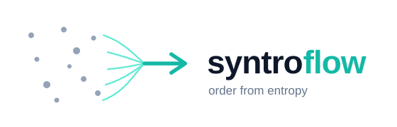

<picture>
  <source media="(prefers-color-scheme: dark)" srcset="assets/syntroflow-horizontal-dark.svg">
  
</picture>

# Syntroflow

**Translate automation workflows between platforms.** Move an n8n, Make, Zapier, Activepieces, Pipedream, or Pabbly workflow to any other platform — without rebuilding it node by node.

> _order from entropy — `S = k log W` → one flow_

---

## The problem

Automation agencies and builders are locked in. A client on Zapier wants to move to n8n to cut costs. A workflow built in Make needs to ship to a customer who only runs Pipedream. Today the only option is to **rebuild every workflow by hand** — re-mapping every trigger, every branch, every field. It is slow, error-prone, and it doesn't scale across a portfolio of clients.

Existing tools each convert **one direction between one pair** of platforms. Nobody covers the full matrix.

## The approach

Syntroflow never translates platform-to-platform directly. Instead every workflow is parsed into one **Universal Workflow Schema (UWS)** — a platform-agnostic intermediate representation — and then serialized back out to the target platform.

```
  n8n  ─┐                                      ┌─►  n8n
  Make ─┤                                      ├─►  Make
 Zapier─┤──►  Parser  ──►  UWS  ──►  Serializer├─►  Zapier
  ...  ─┘                  ▲                    └─►  ...
                           │
                  Schema Registry (open)
                  AI Translator (resolves the hard 10%)
```

This is the key architectural decision: **adding a platform is O(1), not O(n²).** Write one parser and one serializer per platform, and it instantly translates to and from every other platform already in the system.

UWS node types use dot notation:

| Universal type | Meaning |
|---|---|
| `trigger.email.received` | a new email arrives |
| `trigger.webhook.received` | an inbound webhook |
| `logic.condition.branch` | if / else split |
| `transform.data.set` | set or map fields |
| `action.http.request` | outbound HTTP call |
| `action.slack.message` | post to Slack |

## What's in this repo (open core)

This open-source core ships **one fully working direction: n8n → Make.com**, plus the building blocks anyone can extend:

- The **Universal Workflow Schema** (`src/schema/uws.ts`)
- The **`PlatformParser` / `PlatformSerializer` interfaces** every platform implements
- A working **n8n parser** and **Make serializer**
- The **community node-type map** (`src/node-map/`) — PRs welcome

## Quick start

```bash
npm install
npm run demo   # converts examples/n8n-sample.json to a Make blueprint
```

```ts
import { readFileSync } from "fs";
import { n8nToMake } from "./src";

const n8nExport = JSON.parse(readFileSync("./examples/n8n-sample.json", "utf-8"));
const { blueprint, coverage, needsReview } = n8nToMake(n8nExport);

console.log(`Auto-translated ${(coverage * 100).toFixed(0)}% of nodes`);
// needsReview lists any node the open map couldn't place
```

Running against the bundled sample produces:

```
coverage: 100%
make modules: email:TriggerNewEmail -> builtin:BasicRouter -> slack:CreateMessage
```

## What the full product adds (Syntroflow Pro)

The realistic ceiling for automatic translation is roughly **90% of nodes; the last ~10%** are proprietary or ambiguous and need judgment. The hosted product handles that:

- **Every direction** across all six platforms (not just n8n → Make)
- **AI Translator** that resolves ambiguous and proprietary nodes the static map can't
- **Compatibility Report** — a line-by-line list of exactly what was translated, what was approximated, and what needs manual attention before you ship
- A web UI, batch conversion, and team features for agencies

→ Join the waitlist: **https://mohashimgesm-crypto.github.io/syntroflow/**

## Contributing

The fastest way to help: **add a node mapping.** If your favourite n8n node isn't in `src/node-map/n8n.ts` yet, add it and open a PR. New platform parsers and serializers are also very welcome — implement the `PlatformParser` / `PlatformSerializer` interface in `src/parsers/types.ts`.

## Roadmap

- [x] UWS v1.0 + n8n parser + Make serializer (this repo)
- [ ] **Gumloop → n8n** — the "graduate path": start on an easy AI-native tool, move to n8n when you outgrow it _(next up)_
- [ ] Zapier and Activepieces parsers
- [ ] Reverse direction (Make → n8n)
- [ ] Hosted Compatibility Report
- [ ] AI Translator for the ambiguous 10%

## License

MIT — see [LICENSE](./LICENSE). The hosted AI Translator and Compatibility Report are commercial.
